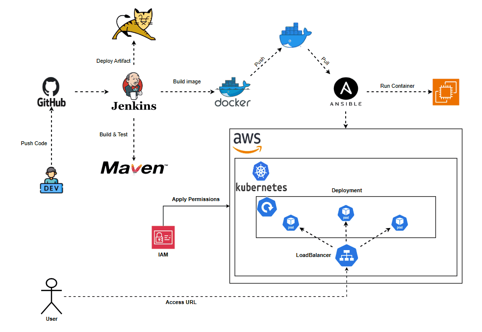

# End to End DevOps project
### Overview
This project demonstrates a complete DevOps workflow for a Java web application. The solution focuses on implementing a CI/CD pipeline to automate the software lifecycle from code push to GitHub to deployment on a Kubernetes cluster on AWS using EKSCTL.

### CI/CD Design

### Objectives
1. Automate the software lifecycle of a Java web application.
2. Implement CI/CD pipeline using Jenkins.
3. Provision and manage a Kubernetes cluster using EKSCTL.
4. Use Ansible for configuration management.
5. Set up and install Apache Tomcat for hosting the Java application.
6. Containerize the application using Docker.